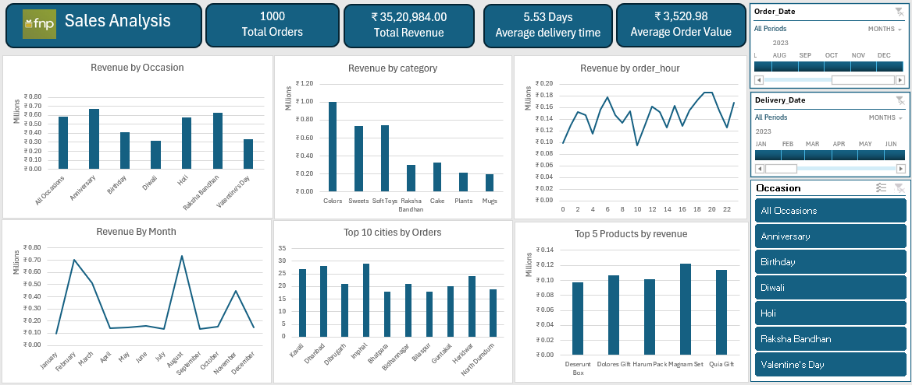

# Fnp-sales-analysis
### **Executive Summary: Sales Analysis Dashboard**  

This **Sales Analysis Dashboard** presents a comprehensive view of business performance, providing insights into revenue trends, customer preferences, product demand, and sales distribution. The data highlights key metrics such as total revenue, average order value, and order distribution across different occasions, categories, and cities.  

## **1. Key Business Metrics**  
- **Total Orders:** 1,000 – A significant increase in sales volume.  
- **Total Revenue:** ₹35,20,984 – The overall revenue generated from sales transactions.  
- **Average Delivery Time:** 5.53 Days – The average duration from order placement to delivery.  
- **Average Order Value:** ₹3,520.98 – The average revenue per order.  

## **2. Revenue Insights**  

### **A. Revenue by Occasion**  
- Raksha Bandhan, Valentine’s Day, and Anniversaries contribute the most to revenue, indicating strong seasonal demand.  
- Other occasions such as Diwali and Holi also see steady sales, but at a comparatively lower rate.  

### **B. Revenue by Product Category**  
- **Top-Performing Categories:**  
  - **Colors:** Generates the highest revenue, indicating strong sales in artistic or decorative products.  
  - **Sweets & Soft Toys:** These categories also contribute significantly to revenue, suggesting they are popular gifting options.  
  - **Raksha Bandhan & Cake:** Show moderate sales, likely due to seasonal demand.  
  - **Plants & Mugs:** Generate relatively lower revenue, possibly niche products with a smaller customer base.  

### **C. Revenue by Month**  
- The **highest revenue-generating months** are **February and August**, likely due to Valentine’s Day and Raksha Bandhan sales peaks.  
- Sales fluctuate across the year, with dips in April–June and October.  
- This insight helps in planning marketing campaigns and inventory management for peak sales periods.  

### **D. Revenue by Order Hour**  
- Sales activity is **consistent throughout the day**, with notable peaks in the **morning (8–10 AM) and evening (6–8 PM)**.  
- These time periods suggest higher customer engagement, possibly due to shopping habits before or after work hours.  

## **3. Geographical & Product Performance**  

### **A. Top 10 Cities by Orders**  
- **Leading cities in sales:**  
  - **Kasol, Dwarka, and Dibrugarh** have the highest number of orders, indicating strong customer bases.  
  - Other notable cities include Bhiwandi, Buxar, and Hyderabad Downtown, showing a diverse distribution of customers.  

### **B. Top 5 Products by Revenue**  
- The highest-grossing products include:  
  1. **Deserunt Box** – A top-selling product, indicating strong customer preference.  
  2. **Dolores Gift Harum Pack** – Popular in gift purchases.  
  3. **Magiram Set** – Another strong revenue contributor.  
  4. **Quia Gift** – Indicates demand for curated gifting solutions.  

## **4. Business Insights & Recommendations**  
✔ **Leverage Seasonal Demand** – Focus on marketing campaigns and stock preparation for peak seasons (February & August).  
✔ **Optimize Product Offerings** – Continue promoting high-selling categories like **Colors, Sweets, and Soft Toys**, while identifying opportunities to boost lower-performing categories.  
✔ **Enhance Regional Marketing** – Target high-performing cities (Kasol, Dwarka, Dibrugarh) with localized promotions to maximize sales.  
✔ **Improve Delivery Speed** – With an average delivery time of 5.53 days, optimizing logistics could further improve customer satisfaction.  
✔ **Promote High-Demand Products** – Push best-selling items like **Deserunt Box and Dolores Gift Harum Pack** through personalized promotions and recommendations.  

---

This dashboard provides valuable insights into customer behavior, sales trends, and business performance, helping decision-makers strategize effectively for continued growth. 🚀
